# machine-learning-J-component
 The idea behind this project is to analyse the data of a consumer durable store and predict the behaviour of customers based on parameters like frequency of visits,purchasing habits  and factors like the location of the branches in relation to their competitor stores.The objective of this project is to predict the reason for a customer not returning to the store and suggesting methods to the store by which the store should influence the customers by enticing them with offers or loyalty bonuses.Customer Behaviour can be influenced by varied factors like pricing,more offers provided by the competitor exhibiting customer disloyalty.The dataset taken into consideration is data from a real retail consumer durable store,”Sathya Agencies,Pvt.Ltd”, A retail giant popular in Tamil Nadu,India.The idea of this project is to turn the non-returning customers into frequent visitors so as to increase brand loyalty and value.
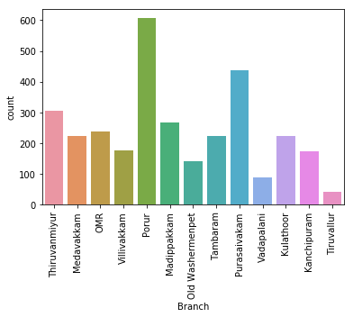 </img>
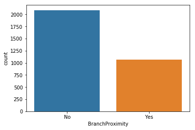 </img>
 </img>
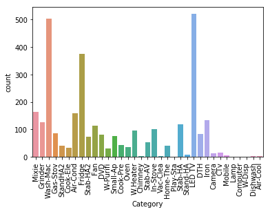 </img>
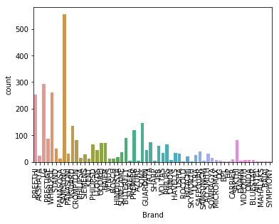 </img>
 </img>
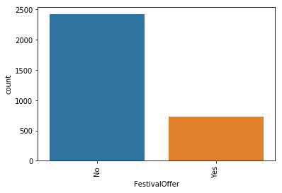 </img>
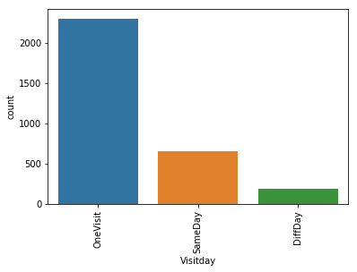 </img>
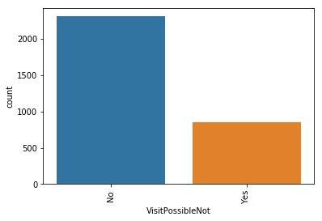 </img>
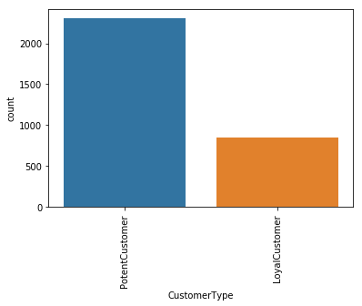 </img>
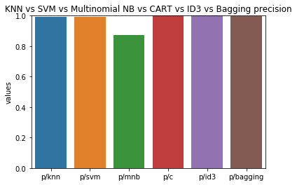 </img>
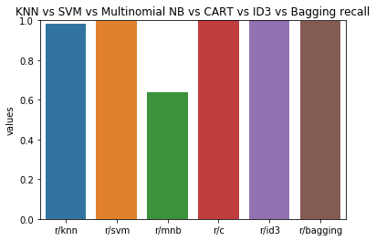 </img>
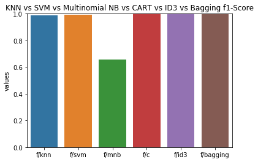 </img>
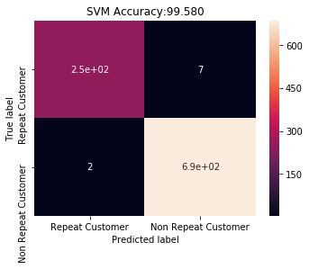 </img>

